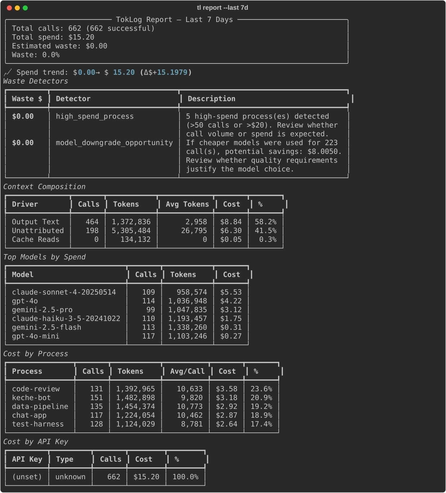

# TokLog

> `htop` for your LLM spend — proxy-only.

TokLog is a local-first HTTP proxy for LLM spend visibility and control.

Route OpenAI-, Anthropic-, and Gemini-compatible traffic through a local proxy. TokLog logs usage locally, attributes cost by model/provider/program/tag, and turns raw traffic into actionable waste reports.

**No hosted backend. No account. No prompt egress by default.**

<p align="center">
  
</p>

---

## Install

```bash
pip install toklog
toklog proxy setup
toklog proxy start --background
```

After setup, clients that support base URL overrides can route through TokLog with no app-specific SDK integration.

---

## What it does

- **Proxy-based capture** — intercepts LLM traffic at the HTTP layer
- **Cross-language** — works with Python, TypeScript, Go, curl, and anything else that can point at a base URL
- **Cross-provider** — OpenAI, Anthropic, Gemini
- **Local logs** — normalized JSONL logs under `~/.toklog/logs/`
- **Spend reports** — model, provider, endpoint, program, and tag breakdowns
- **Waste detection** — highlights expensive patterns worth fixing first
- **Shareable output** — terminal and exported reports

---

## Core commands

```bash
toklog proxy setup
toklog proxy start --background
toklog proxy status
toklog proxy stop

toklog report
toklog gain
toklog share --open
toklog doctor
```

---

## License

MIT
