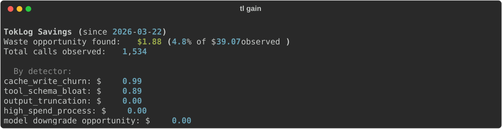
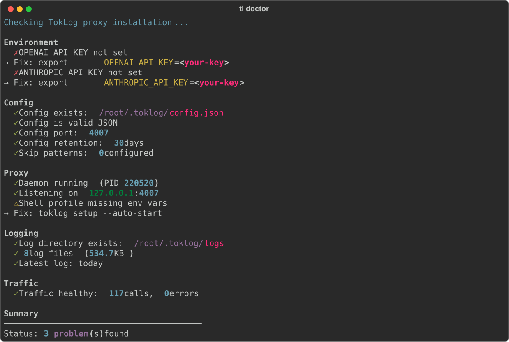
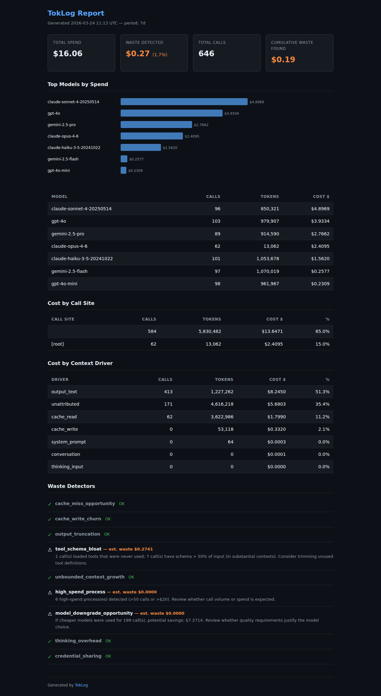
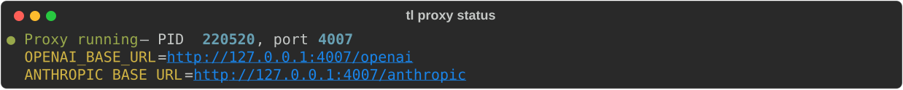

# TokLog

[](https://github.com/erogol/toklog/actions/workflows/ci.yml)
[](https://pypi.org/project/toklog/)
[](LICENSE)
[](https://github.com/coqui-ai/keche)

> `htop` for your LLM spend — proxy-only.

TokLog is a local-first HTTP proxy for LLM spend visibility and control.

Route OpenAI-, Anthropic-, and Gemini-compatible traffic through a local proxy. TokLog logs usage locally, attributes cost by model/provider/program/tag, and turns raw traffic into actionable waste reports.

**No hosted backend. No account. No prompt egress by default.**

---

## Install

```bash
pip install toklog
tl proxy setup
tl proxy start --background
```

After setup, clients that support base URL overrides can route through TokLog with no app-specific SDK integration.

---

## What it does

- **Proxy-based capture** — intercepts LLM traffic at the HTTP layer
- **Cross-language** — works with Python, TypeScript, Go, curl, and anything else that can point at a base URL
- **Cross-provider** — OpenAI, Anthropic, Gemini
- **Local logs** — normalized JSONL logs under `~/.toklog/logs/`
- **Spend reports** — model, provider, endpoint, program, and tag breakdowns
- **Waste detection** — highlights expensive patterns worth fixing first
- **Shareable output** — terminal and exported reports

---

## Core commands

### `tl report`

Full spend breakdown — models, processes, context composition, waste detectors.

```bash
tl report           # last 7 days
tl report --last 30d
```

<p align="center">
  
</p>

### `tl gain`

Cumulative savings opportunities — shows how much waste each detector has found since install.

```bash
tl gain
```

<p align="center">
  
</p>

### `tl doctor`

Health check — verifies config, proxy, env vars, logging, and traffic.

```bash
tl doctor
```

<p align="center">
  
</p>

### `tl share`

Generate a self-contained HTML report you can share — no server needed.

```bash
tl share             # save to ~/.toklog/reports/
tl share --open      # save and open in browser
```

<p align="center">
  
</p>

### `tl proxy status`

Check if the proxy daemon is running and where it's listening.

```bash
tl proxy status
```

<p align="center">
  
</p>

### Other commands

```bash
tl proxy setup          # interactive setup wizard
tl proxy start --background
tl proxy stop
tl tail                 # live stream of logged calls
tl categories           # list detected call categories
tl pricing              # show model pricing table
tl reset                # clear all logs and config
```

---

## License

[TBFUL-1.0](LICENSE) — free for non-commercial and small-scale use. Commercial license required above $10k annual LLM spend.
